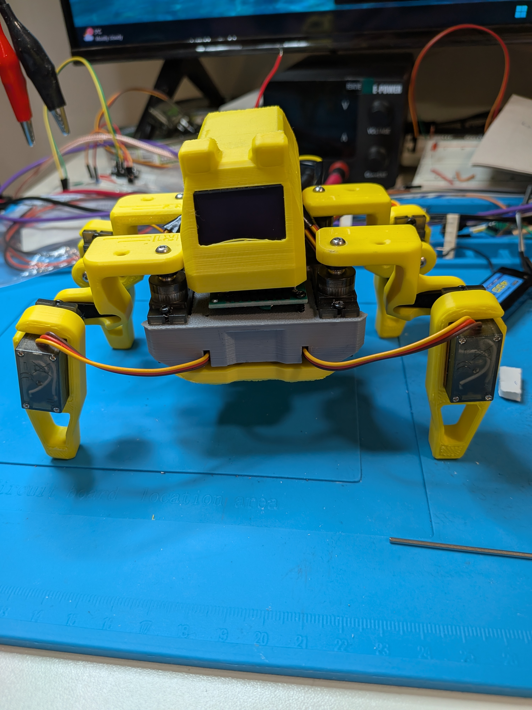
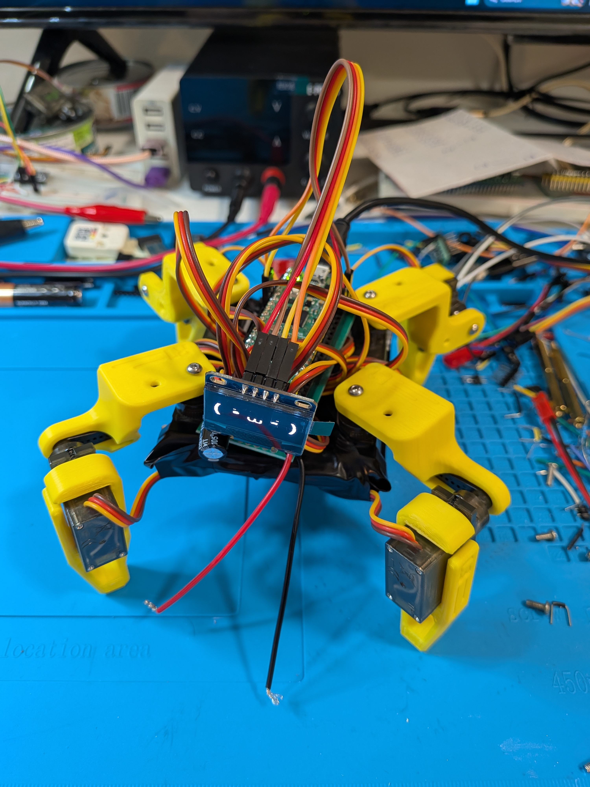

# quadruped-spider-robot
My slightly different version of the Sesame Robot project.  My primary reason for building this robot, is to use it as a learning and development environment.  For example, I plan to use this platform to develop some power management code, specific to some of the hardware used on this particular robot, ie the servos, oled, dc-dc converter, pi pico.

I am not using the same microcontroller as the original project, nor am I using the exact circuit design.  This is fairly quick and dirty at the moment.  To make the code easier for myself to follow, I did a quick separation of the source into easier to follow pieces.  The separation is not ideal at this moment or well structured.  I just wanted to quickly workout the hardware design and get it operating.

Status:  Currently operating using external power supply.  The legs from the original project have been 3d printed, but as I was not sure of how well my changes would fit in the original frame and body, I have temporarily built a quick frame out of foam board and black tape.  It works and I believe the original design will work with my circuit built on a prototype board.

Update:  Well, my circuit board was too big to allow space for all the excess servo wires, even without the power switch.  With the power switch, it is even worse.  It is ever so slightly too wide and too long, however, the main issue is the height of the components, leaving little space for all that excess wire.  Following is image without power switch.  I have also added a fair amount of additional images of various pieces of my build.

Note:  I added a transister divider circuit to the battery in connection to the dc-dc power converter, to add the ability of the pi pico to read the voltage and calculate a rough percentage of available power.  I have some code to send the current reading to the serial console every 5 seconds, plus the test button on my version of the robot control html page sends the current voltage to the log at the bottom of the page.  Note:  When I first attempted to monitor the voltage, I discovered that the pi pico 2 w that I was using was defective and the analog pins did not function.  It appears to be a clone board, so I was not surprised.  I ordered a new pi pico 2 w, and the power monitoring works.

Warning:  I already made the mistake of forgetting to shutoff the robot.  Luckily, it was only a little over an hour and the I caught it with the 2s battery cells being just over 3.0 volts.  As lipos often have no low voltage cutoff protection built in, the batteries can drop down to voltages that are first, damaging to the battery and even worse, dangerous.  All my other devices have some circuitry to protect against this issue, so I forgot to be extra cautious.  I have decided it would be best to add a protection feature into my circuit.  My first thought was to build a soft power switch, controlled by a momentary switch and the microprocessor.  I then remembered that the dc-dc buck converter I used has an enable pin on it.  So I tested this pin quickly and found that by bringing it LOW, the dc-dc converter shuts down and only uses about 0.02 mA according to my tester.  It should be relatively easy then to use this to have the microcontroller automatically shutdown if the battery voltage drops below a certain level.  I will add this feature in the near future.

The code is still very much a messy work in progress.  I have add most of the updates from the original project to support the AI features and parially tested it with the Python CLI version of the code.

Following is a link to the original project this is based on.

https://github.com/dorianborian/sesame-robot

The foamboard and black electrical tape version of the robot.

