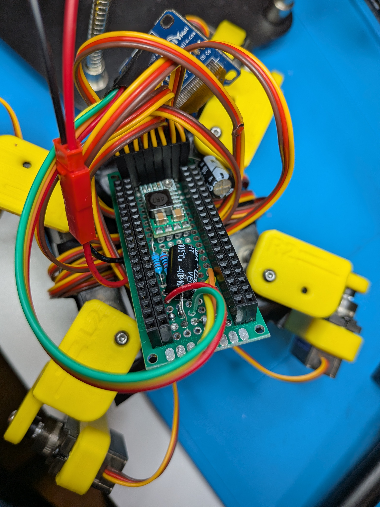
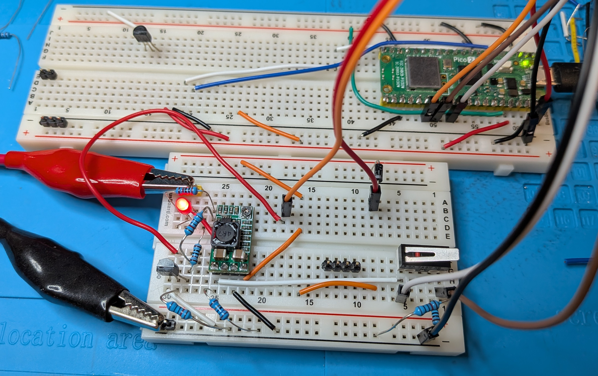

The file circuit.txt contains a text outline of the current circuit, minus a few recent changes

File divider.circuit.txt contains a text outline of the improved voltage sense circuit, which draws virtually zero power from the battery when not enabled.  This extends the time at which the robot can be powered down without the battery becoming discharged.  There is still a slight amount of current when the buck converter is disabled, but it is reasonably small.  This is to allow a soft power button to be used, so the robot can shutdown automatically if the battery voltage gets too low or if it has been idle for too long.

Closeup image of the dc-dc buck converter.

The most current version of the breadboard test circuit.

Image of what is under the microcontroller on the current robot prototype circuit.

